## Task 1.5: Training

### Simple

Final result: **50/50 correct**, loss **0.8570355016079586**.

| Final classification | Training loss |
| --- | --- |
| 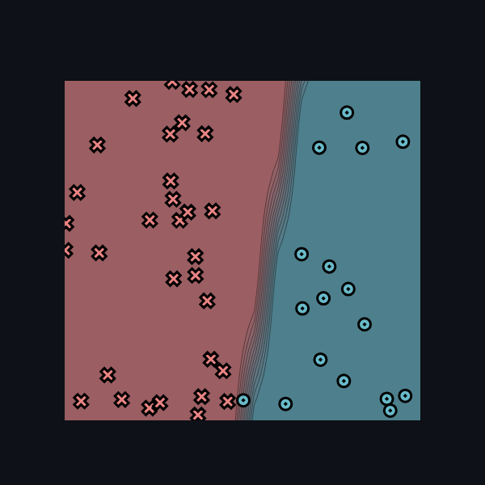 | 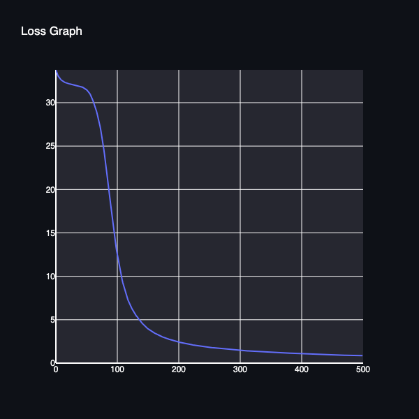 |

<details>
<summary>Training log</summary>

```text
Epoch: 10/500, loss: 32.5942043863515, correct: 33
Epoch: 20/500, loss: 32.22062027056987, correct: 33
Epoch: 30/500, loss: 32.05748912243191, correct: 33
Epoch: 40/500, loss: 31.89352835294471, correct: 33
Epoch: 50/500, loss: 31.539259646575974, correct: 33
Epoch: 60/500, loss: 30.487248385827368, correct: 33
Epoch: 70/500, loss: 28.223122738809316, correct: 33
Epoch: 80/500, loss: 24.121946071619192, correct: 44
Epoch: 90/500, loss: 18.37288153905436, correct: 50
Epoch: 100/500, loss: 12.903933161255262, correct: 50
Epoch: 110/500, loss: 9.252338484313993, correct: 50
Epoch: 120/500, loss: 6.986643170651309, correct: 49
Epoch: 130/500, loss: 5.648817520372043, correct: 49
Epoch: 140/500, loss: 4.70929971161999, correct: 49
Epoch: 150/500, loss: 4.004222308344367, correct: 49
Epoch: 160/500, loss: 3.5280260152307816, correct: 50
Epoch: 170/500, loss: 3.16033686526761, correct: 50
Epoch: 180/500, loss: 2.879074095480501, correct: 50
Epoch: 190/500, loss: 2.6420048299287884, correct: 50
Epoch: 200/500, loss: 2.4447068930664386, correct: 50
Epoch: 210/500, loss: 2.2848498584702104, correct: 50
Epoch: 220/500, loss: 2.141276209135468, correct: 50
Epoch: 230/500, loss: 2.0212328870461893, correct: 50
Epoch: 240/500, loss: 1.9159294916000293, correct: 50
Epoch: 250/500, loss: 1.8238554607863513, correct: 50
Epoch: 260/500, loss: 1.7403385031814838, correct: 50
Epoch: 270/500, loss: 1.6659912548383689, correct: 50
Epoch: 280/500, loss: 1.5985827374355956, correct: 50
Epoch: 290/500, loss: 1.537112249521392, correct: 50
Epoch: 300/500, loss: 1.480518603020594, correct: 50
Epoch: 310/500, loss: 1.4281684009980433, correct: 50
Epoch: 320/500, loss: 1.3795394358191575, correct: 50
Epoch: 330/500, loss: 1.3341969323847334, correct: 50
Epoch: 340/500, loss: 1.2917756431512157, correct: 50
Epoch: 350/500, loss: 1.2519661829529767, correct: 50
Epoch: 360/500, loss: 1.2145387162515977, correct: 50
Epoch: 370/500, loss: 1.1794778044248475, correct: 50
Epoch: 380/500, loss: 1.146292719671084, correct: 50
Epoch: 390/500, loss: 1.1148189151969075, correct: 50
Epoch: 400/500, loss: 1.0855751911083242, correct: 50
Epoch: 410/500, loss: 1.0575649375896008, correct: 50
Epoch: 420/500, loss: 1.0313293705002202, correct: 50
Epoch: 430/500, loss: 1.0062728236305614, correct: 50
Epoch: 440/500, loss: 0.9822901289312687, correct: 50
Epoch: 450/500, loss: 0.9592977379717201, correct: 50
Epoch: 460/500, loss: 0.9372276153197378, correct: 50
Epoch: 470/500, loss: 0.9160187309102905, correct: 50
Epoch: 480/500, loss: 0.8956161162532492, correct: 50
Epoch: 490/500, loss: 0.8759700723500362, correct: 50
Epoch: 500/500, loss: 0.8570355016079586, correct: 50
```

</details>


### Diag

Final result: **50/50 correct**, loss
**0.3252484582130189**.

| Final classification | Training loss |
| --- | --- |
| 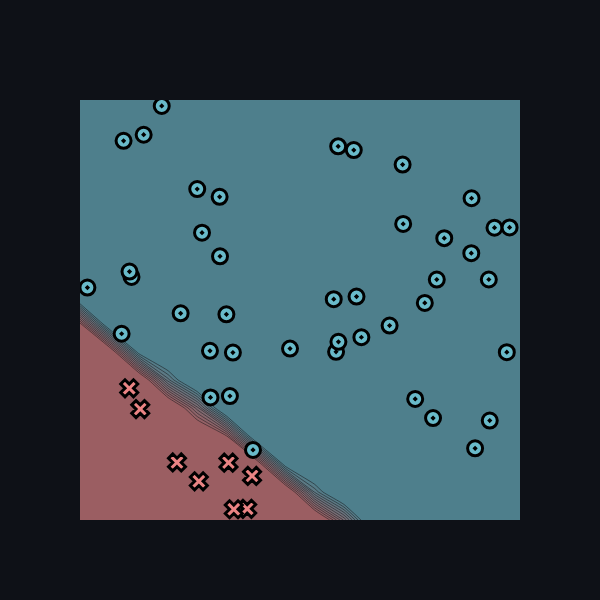 | 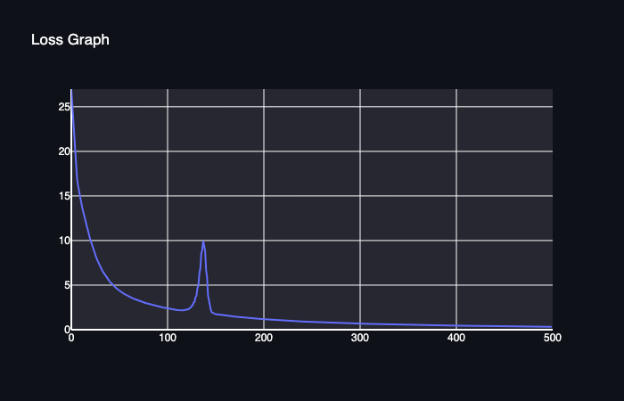 |

<details>
<summary>Training log</summary>

```text
Epoch: 10/500, loss: 14.905532165593012, correct: 42
Epoch: 20/500, loss: 10.38950304403606, correct: 42
Epoch: 30/500, loss: 7.312993885497134, correct: 48
Epoch: 40/500, loss: 5.524477551308183, correct: 49
Epoch: 50/500, loss: 4.456714272514114, correct: 49
Epoch: 60/500, loss: 3.7754429517634196, correct: 49
Epoch: 70/500, loss: 3.2984938511946216, correct: 49
Epoch: 80/500, loss: 2.9372180842780935, correct: 49
Epoch: 90/500, loss: 2.6461463531284206, correct: 49
Epoch: 100/500, loss: 2.401558853302622, correct: 49
Epoch: 110/500, loss: 2.2152875673195664, correct: 49
Epoch: 120/500, loss: 2.2359670441644157, correct: 49
Epoch: 130/500, loss: 3.633150863567267, correct: 49
Epoch: 140/500, loss: 8.841776251149854, correct: 46
Epoch: 150/500, loss: 1.7828535097592266, correct: 49
Epoch: 160/500, loss: 1.6114721393880473, correct: 50
Epoch: 170/500, loss: 1.479346566245592, correct: 50
Epoch: 180/500, loss: 1.3679061410797138, correct: 50
Epoch: 190/500, loss: 1.2719308675501368, correct: 50
Epoch: 200/500, loss: 1.1878486879449968, correct: 50
Epoch: 210/500, loss: 1.1132004573618695, correct: 50
Epoch: 220/500, loss: 1.046260542969607, correct: 50
Epoch: 230/500, loss: 0.9857799440445321, correct: 50
Epoch: 240/500, loss: 0.9308204189402146, correct: 50
Epoch: 250/500, loss: 0.8806508632913865, correct: 50
Epoch: 260/500, loss: 0.8346830366001151, correct: 50
Epoch: 270/500, loss: 0.7924265218539415, correct: 50
Epoch: 280/500, loss: 0.7533600079827784, correct: 50
Epoch: 290/500, loss: 0.7172573587514601, correct: 50
Epoch: 300/500, loss: 0.6838166005030348, correct: 50
Epoch: 310/500, loss: 0.6527751769618798, correct: 50
Epoch: 320/500, loss: 0.6239032740500879, correct: 50
Epoch: 330/500, loss: 0.5969986823911652, correct: 50
Epoch: 340/500, loss: 0.5718827037905443, correct: 50
Epoch: 350/500, loss: 0.5483968221007007, correct: 50
Epoch: 360/500, loss: 0.5265333711809249, correct: 50
Epoch: 370/500, loss: 0.5060772995763071, correct: 50
Epoch: 380/500, loss: 0.4868750139993264, correct: 50
Epoch: 390/500, loss: 0.46882394133969574, correct: 50
Epoch: 400/500, loss: 0.45183191858448224, correct: 50
Epoch: 410/500, loss: 0.4358159242977767, correct: 50
Epoch: 420/500, loss: 0.4207009953344741, correct: 50
Epoch: 430/500, loss: 0.4064192957648568, correct: 50
Epoch: 440/500, loss: 0.3929093119042454, correct: 50
Epoch: 450/500, loss: 0.38011515328229944, correct: 50
Epoch: 460/500, loss: 0.36798594329998735, correct: 50
Epoch: 470/500, loss: 0.356475286286255, correct: 50
Epoch: 480/500, loss: 0.3455407999685848, correct: 50
Epoch: 490/500, loss: 0.33514370419511413, correct: 50
Epoch: 500/500, loss: 0.3252484582130189, correct: 50
```

</details>

### Split

Final result: **50/50 correct**, loss **0.4469719299825899**.

| Final classification | Training loss |
| --- | --- |
| 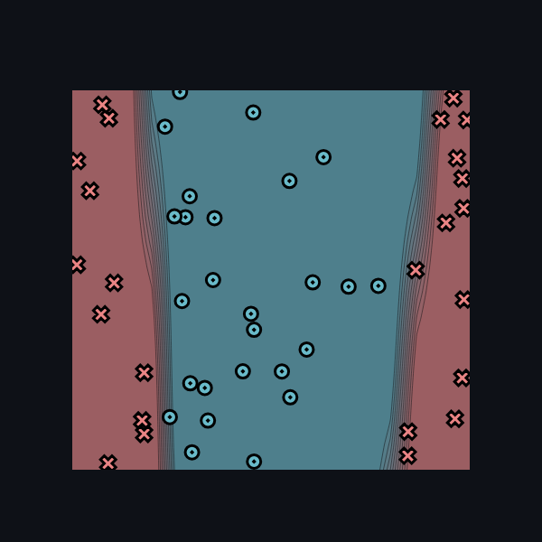 | 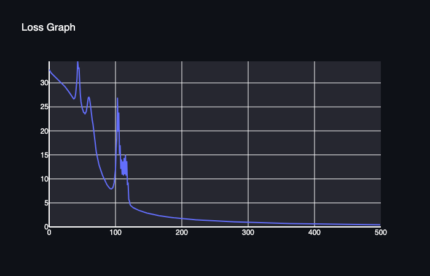 |

<details>
<summary>Training log</summary>

```text
Epoch: 10/500, loss: 31.293044984890425, correct: 35
Epoch: 20/500, loss: 29.981164029121338, correct: 36
Epoch: 30/500, loss: 28.26864981237409, correct: 37
Epoch: 40/500, loss: 27.00120833408374, correct: 39
Epoch: 50/500, loss: 25.24412930345733, correct: 37
Epoch: 60/500, loss: 26.860439987706553, correct: 29
Epoch: 70/500, loss: 17.43915342429649, correct: 46
Epoch: 80/500, loss: 11.304415653749148, correct: 48
Epoch: 90/500, loss: 8.413862683438397, correct: 50
Epoch: 100/500, loss: 10.641119623902735, correct: 44
Epoch: 110/500, loss: 14.036400991737908, correct: 43
Epoch: 120/500, loss: 9.26181710487445, correct: 48
Epoch: 130/500, loss: 3.836111427442229, correct: 50
Epoch: 140/500, loss: 3.2567374546938197, correct: 50
Epoch: 150/500, loss: 2.841658155566532, correct: 50
Epoch: 160/500, loss: 2.523771596854331, correct: 50
Epoch: 170/500, loss: 2.2717428110371256, correct: 50
Epoch: 180/500, loss: 2.0660531325412106, correct: 50
Epoch: 190/500, loss: 1.8941405201588661, correct: 50
Epoch: 200/500, loss: 1.7477369920836159, correct: 50
Epoch: 210/500, loss: 1.6212358206707427, correct: 50
Epoch: 220/500, loss: 1.5108065838579097, correct: 50
Epoch: 230/500, loss: 1.4134554832865502, correct: 50
Epoch: 240/500, loss: 1.3268512298633248, correct: 50
Epoch: 250/500, loss: 1.2492094000573921, correct: 50
Epoch: 260/500, loss: 1.1791430066072084, correct: 50
Epoch: 270/500, loss: 1.115572836268252, correct: 50
Epoch: 280/500, loss: 1.0576187850681038, correct: 50
Epoch: 290/500, loss: 1.0045968176457711, correct: 50
Epoch: 300/500, loss: 0.9560079520522682, correct: 50
Epoch: 310/500, loss: 0.9112268572398029, correct: 50
Epoch: 320/500, loss: 0.8698136605287325, correct: 50
Epoch: 330/500, loss: 0.8314153834739816, correct: 50
Epoch: 340/500, loss: 0.795729919239253, correct: 50
Epoch: 350/500, loss: 0.7624791391608872, correct: 50
Epoch: 360/500, loss: 0.7314270524939835, correct: 50
Epoch: 370/500, loss: 0.7023661615161554, correct: 50
Epoch: 380/500, loss: 0.6751350205695129, correct: 50
Epoch: 390/500, loss: 0.6495887805599923, correct: 50
Epoch: 400/500, loss: 0.6255615714480479, correct: 50
Epoch: 410/500, loss: 0.6029276273714503, correct: 50
Epoch: 420/500, loss: 0.5815785967591754, correct: 50
Epoch: 430/500, loss: 0.5614154720988677, correct: 50
Epoch: 440/500, loss: 0.5423492980570801, correct: 50
Epoch: 450/500, loss: 0.5243003485724326, correct: 50
Epoch: 460/500, loss: 0.5071972245484025, correct: 50
Epoch: 470/500, loss: 0.4909697934820889, correct: 50
Epoch: 480/500, loss: 0.47555891029521397, correct: 50
Epoch: 490/500, loss: 0.4609094809873844, correct: 50
Epoch: 500/500, loss: 0.4469719299825899, correct: 50
```

</details>

### Xor

Final result: **50/50 correct**, loss **0.7917695693425144**.

| Final classification | Training loss |
| --- | --- |
| 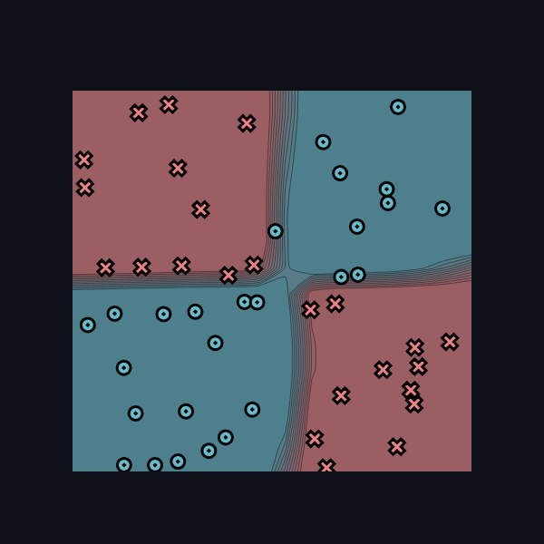 | 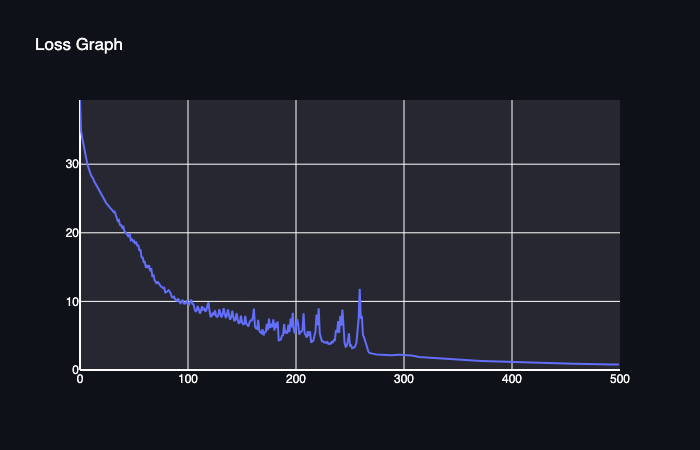 |

<details>
<summary>Training log</summary>

```text
Epoch: 10/500, loss: 28.80932005574582, correct: 37
Epoch: 20/500, loss: 25.831910179307386, correct: 41
Epoch: 30/500, loss: 23.420002449571022, correct: 46
Epoch: 40/500, loss: 20.787248090125647, correct: 46
Epoch: 50/500, loss: 18.773854962325, correct: 41
Epoch: 60/500, loss: 15.733027976201997, correct: 46
Epoch: 70/500, loss: 13.091563745817112, correct: 48
Epoch: 80/500, loss: 11.304695985582214, correct: 47
Epoch: 90/500, loss: 10.100238095331191, correct: 49
Epoch: 100/500, loss: 10.159764820267958, correct: 45
Epoch: 110/500, loss: 9.318703606508375, correct: 47
Epoch: 120/500, loss: 9.87274614084346, correct: 44
Epoch: 130/500, loss: 8.86862320102342, correct: 45
Epoch: 140/500, loss: 7.340140617714774, correct: 47
Epoch: 150/500, loss: 7.90888472645245, correct: 47
Epoch: 160/500, loss: 7.216582902523949, correct: 47
Epoch: 170/500, loss: 5.948126671080115, correct: 47
Epoch: 180/500, loss: 7.390029813684374, correct: 46
Epoch: 190/500, loss: 6.695991279615585, correct: 47
Epoch: 200/500, loss: 5.322632138647319, correct: 48
Epoch: 210/500, loss: 5.004779065492958, correct: 49
Epoch: 220/500, loss: 8.094890076005797, correct: 43
Epoch: 230/500, loss: 4.064697005569773, correct: 50
Epoch: 240/500, loss: 7.1099993952621094, correct: 47
Epoch: 250/500, loss: 5.330272826448701, correct: 47
Epoch: 260/500, loss: 11.828863471149011, correct: 43
Epoch: 270/500, loss: 2.4383685607308268, correct: 50
Epoch: 280/500, loss: 2.1968365541919956, correct: 50
Epoch: 290/500, loss: 2.1641005496597017, correct: 50
Epoch: 300/500, loss: 2.179007683123346, correct: 50
Epoch: 310/500, loss: 2.0563330284612182, correct: 50
Epoch: 320/500, loss: 1.8292448258291218, correct: 50
Epoch: 330/500, loss: 1.711359451155042, correct: 50
Epoch: 340/500, loss: 1.6009828069152507, correct: 50
Epoch: 350/500, loss: 1.5067374717770263, correct: 50
Epoch: 360/500, loss: 1.4240288937696959, correct: 50
Epoch: 370/500, loss: 1.3310937657725876, correct: 50
Epoch: 380/500, loss: 1.2703529778676739, correct: 50
Epoch: 390/500, loss: 1.2128478127260789, correct: 50
Epoch: 400/500, loss: 1.1623561066840133, correct: 50
Epoch: 410/500, loss: 1.1149441526205612, correct: 50
Epoch: 420/500, loss: 1.0699302841983638, correct: 50
Epoch: 430/500, loss: 1.0278497511352616, correct: 50
Epoch: 440/500, loss: 0.9896359202139133, correct: 50
Epoch: 450/500, loss: 0.9464686956274557, correct: 50
Epoch: 460/500, loss: 0.9192531962064462, correct: 50
Epoch: 470/500, loss: 0.8822779425055712, correct: 50
Epoch: 480/500, loss: 0.8470934486426289, correct: 50
Epoch: 490/500, loss: 0.8218118263109964, correct: 50
Epoch: 500/500, loss: 0.7917695693425144, correct: 50
```

</details>

## Task 2.5: Training


| Dataset | Hidden layer | Time per epoch |
| --- | ---: | ---: |
| Simple | 2 | 0.049 s |
| Diag | 5 | 0.130 s |
| Split | 5 | 0.133 s |
| Xor | 12 | 0.356 s |

### Simple

Final result: **50/50 correct**, loss **1.1768614981794974**.

| Final classification | Training loss |
|---|---|
| 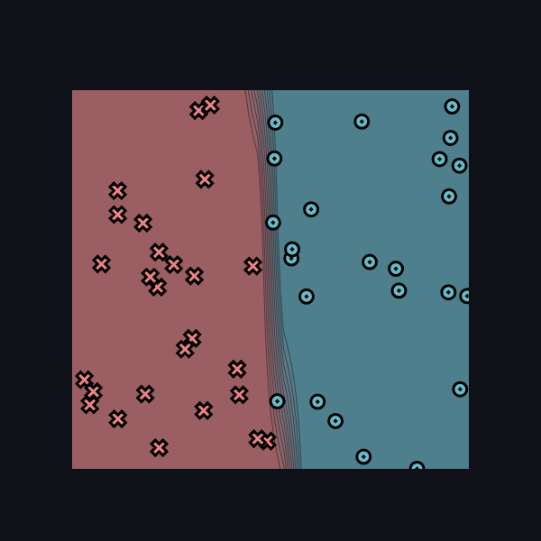 | 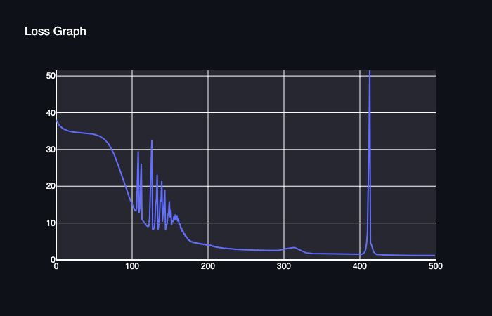 |

<details>
<summary>Training log</summary>

```text
Epoch: 10/500, loss: 35.67798555128497, correct: 19
Epoch: 20/500, loss: 34.8996969390812, correct: 11
Epoch: 30/500, loss: 34.61049546749241, correct: 26
Epoch: 40/500, loss: 34.458265966254366, correct: 26
Epoch: 50/500, loss: 34.158046702355335, correct: 26
Epoch: 60/500, loss: 33.41760304256282, correct: 26
Epoch: 70/500, loss: 31.50955719822463, correct: 38
Epoch: 80/500, loss: 27.252017514783862, correct: 41
Epoch: 90/500, loss: 21.223248419788597, correct: 43
Epoch: 100/500, loss: 15.547135433104211, correct: 49
Epoch: 110/500, loss: 12.608335244495663, correct: 47
Epoch: 120/500, loss: 9.339642740897693, correct: 49
Epoch: 130/500, loss: 8.61927495191163, correct: 49
Epoch: 140/500, loss: 21.395776528215627, correct: 41
Epoch: 150/500, loss: 15.95409787875386, correct: 42
Epoch: 160/500, loss: 12.090593513314193, correct: 44
Epoch: 170/500, loss: 7.148857209768297, correct: 48
Epoch: 180/500, loss: 4.914736130569677, correct: 49
Epoch: 190/500, loss: 4.452047355934722, correct: 49
Epoch: 200/500, loss: 4.128758560318431, correct: 49
Epoch: 210/500, loss: 3.555927469862505, correct: 49
Epoch: 220/500, loss: 3.2091821987520817, correct: 50
Epoch: 230/500, loss: 3.0311302260113218, correct: 50
Epoch: 240/500, loss: 2.889947267172737, correct: 50
Epoch: 250/500, loss: 2.7758928518959256, correct: 50
Epoch: 260/500, loss: 2.6878472378193212, correct: 49
Epoch: 270/500, loss: 2.6262712345882067, correct: 49
Epoch: 280/500, loss: 2.590101944562451, correct: 49
Epoch: 290/500, loss: 2.5735634697346987, correct: 49
Epoch: 300/500, loss: 2.8501159956610804, correct: 49
Epoch: 310/500, loss: 3.340283173568121, correct: 49
Epoch: 320/500, loss: 2.796107575342835, correct: 49
Epoch: 330/500, loss: 1.933581197551434, correct: 50
Epoch: 340/500, loss: 1.7227188747730764, correct: 50
Epoch: 350/500, loss: 1.649233708368904, correct: 50
Epoch: 360/500, loss: 1.5838044066577819, correct: 50
Epoch: 370/500, loss: 1.5289352053346754, correct: 50
Epoch: 380/500, loss: 1.479364708342889, correct: 50
Epoch: 390/500, loss: 1.4367585458597083, correct: 50
Epoch: 400/500, loss: 1.418828214465452, correct: 50
Epoch: 410/500, loss: 4.806413301887151, correct: 48
Epoch: 420/500, loss: 1.9862902407911487, correct: 49
Epoch: 430/500, loss: 1.3723837373210608, correct: 50
Epoch: 440/500, loss: 1.3055606034067033, correct: 50
Epoch: 450/500, loss: 1.2689143065524746, correct: 50
Epoch: 460/500, loss: 1.239474456309691, correct: 50
Epoch: 470/500, loss: 1.213243809419684, correct: 50
Epoch: 480/500, loss: 1.1916050003361363, correct: 50
Epoch: 490/500, loss: 1.1771401400158916, correct: 50
Epoch: 500/500, loss: 1.1768614981794974, correct: 50
```

</details>

### Diag

Final result: **50/50 correct**, loss **0.43431779743356086**.

| Final classification | Training loss |
|---|---|
| 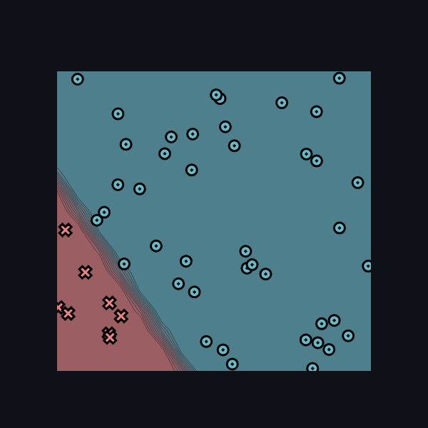 | 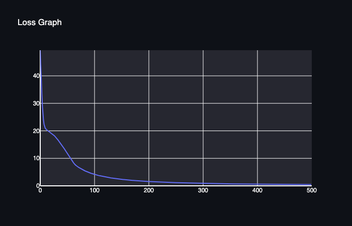 |

<details>
<summary>Training log</summary>

```text
Epoch: 10/500, loss: 21.073056987235937, correct: 42
Epoch: 20/500, loss: 19.34516384400511, correct: 42
Epoch: 30/500, loss: 17.608531680361924, correct: 42
Epoch: 40/500, loss: 15.030015339743901, correct: 42
Epoch: 50/500, loss: 12.028116676502515, correct: 42
Epoch: 60/500, loss: 9.01977040042721, correct: 46
Epoch: 70/500, loss: 6.9411392863282435, correct: 47
Epoch: 80/500, loss: 5.776689860153964, correct: 50
Epoch: 90/500, loss: 4.873885447660626, correct: 50
Epoch: 100/500, loss: 4.208819273786438, correct: 50
Epoch: 110/500, loss: 3.6802558344878267, correct: 50
Epoch: 120/500, loss: 3.258113916855601, correct: 50
Epoch: 130/500, loss: 2.906960881265275, correct: 50
Epoch: 140/500, loss: 2.61196031698017, correct: 50
Epoch: 150/500, loss: 2.3708953384358, correct: 50
Epoch: 160/500, loss: 2.165248496812227, correct: 50
Epoch: 170/500, loss: 1.9874994006955455, correct: 50
Epoch: 180/500, loss: 1.8327265460863977, correct: 50
Epoch: 190/500, loss: 1.689175636345154, correct: 50
Epoch: 200/500, loss: 1.5695861811390779, correct: 50
Epoch: 210/500, loss: 1.4653737874174255, correct: 50
Epoch: 220/500, loss: 1.372451143944164, correct: 50
Epoch: 230/500, loss: 1.289143468480199, correct: 50
Epoch: 240/500, loss: 1.2140931352272426, correct: 50
Epoch: 250/500, loss: 1.1461862485954857, correct: 50
Epoch: 260/500, loss: 1.0844992481158626, correct: 50
Epoch: 270/500, loss: 1.0282594229992348, correct: 50
Epoch: 280/500, loss: 0.9768149822713245, correct: 50
Epoch: 290/500, loss: 0.9296121719275994, correct: 50
Epoch: 300/500, loss: 0.8861774917013572, correct: 50
Epoch: 310/500, loss: 0.8461037014328728, correct: 50
Epoch: 320/500, loss: 0.8090386865954323, correct: 50
Epoch: 330/500, loss: 0.7746765108700119, correct: 50
Epoch: 340/500, loss: 0.7427501625241348, correct: 50
Epoch: 350/500, loss: 0.7130256272695182, correct: 50
Epoch: 360/500, loss: 0.685297010346533, correct: 50
Epoch: 370/500, loss: 0.6593824959964412, correct: 50
Epoch: 380/500, loss: 0.6351209806623689, correct: 50
Epoch: 390/500, loss: 0.612467419605307, correct: 50
Epoch: 400/500, loss: 0.5914531081359965, correct: 50
Epoch: 410/500, loss: 0.5714583142183765, correct: 50
Epoch: 420/500, loss: 0.5526162326793571, correct: 50
Epoch: 430/500, loss: 0.5346264767399609, correct: 50
Epoch: 440/500, loss: 0.5181119509887104, correct: 50
Epoch: 450/500, loss: 0.5020556862637778, correct: 50
Epoch: 460/500, loss: 0.4872164911361663, correct: 50
Epoch: 470/500, loss: 0.47290676886147975, correct: 50
Epoch: 480/500, loss: 0.4594258049034459, correct: 50
Epoch: 490/500, loss: 0.44668648751003687, correct: 50
Epoch: 500/500, loss: 0.43431779743356086, correct: 50
```

</details>

### Split

Final result: **50/50 correct**, loss **1.4970145939547561**.

| Final classification | Training loss |
|---|---|
| 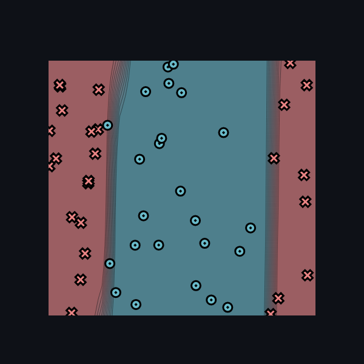 | 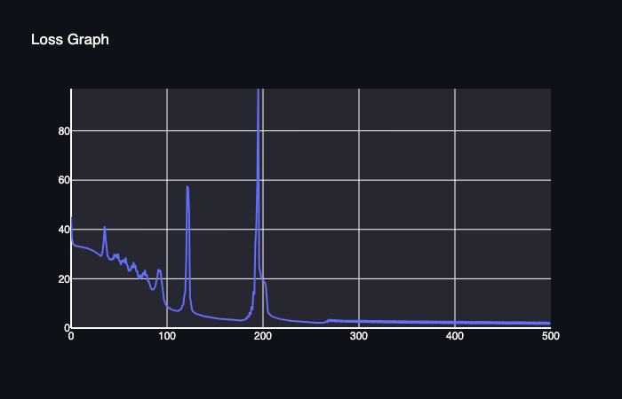 |

<details>
<summary>Training log</summary>

```text
Epoch: 10/500, loss: 33.074858905358404, correct: 31
Epoch: 20/500, loss: 32.090255398421014, correct: 32
Epoch: 30/500, loss: 29.704911862254708, correct: 35
Epoch: 40/500, loss: 28.734090210046332, correct: 34
Epoch: 50/500, loss: 30.186643793289004, correct: 30
Epoch: 60/500, loss: 25.268498792397814, correct: 32
Epoch: 70/500, loss: 23.214437308619804, correct: 33
Epoch: 80/500, loss: 21.65901628403935, correct: 37
Epoch: 90/500, loss: 19.422298369717055, correct: 37
Epoch: 100/500, loss: 9.269320255615062, correct: 49
Epoch: 110/500, loss: 6.976415906492928, correct: 49
Epoch: 120/500, loss: 14.81711100675231, correct: 42
Epoch: 130/500, loss: 6.1010219096194716, correct: 49
Epoch: 140/500, loss: 4.780783447649931, correct: 49
Epoch: 150/500, loss: 4.080300787274613, correct: 49
Epoch: 160/500, loss: 3.5805213543289565, correct: 49
Epoch: 170/500, loss: 3.201375528658983, correct: 49
Epoch: 180/500, loss: 3.154668839996421, correct: 50
Epoch: 190/500, loss: 7.319327290035458, correct: 47
Epoch: 200/500, loss: 19.641777919131044, correct: 40
Epoch: 210/500, loss: 4.839713959505594, correct: 49
Epoch: 220/500, loss: 3.5520486253827426, correct: 50
Epoch: 230/500, loss: 2.942394209430435, correct: 50
Epoch: 240/500, loss: 2.555673770907934, correct: 50
Epoch: 250/500, loss: 2.2816344474211894, correct: 50
Epoch: 260/500, loss: 2.1016186618246655, correct: 50
Epoch: 270/500, loss: 2.6059206030615747, correct: 50
Epoch: 280/500, loss: 2.4494866204686514, correct: 50
Epoch: 290/500, loss: 2.3240737416206994, correct: 50
Epoch: 300/500, loss: 2.2418743537950454, correct: 50
Epoch: 310/500, loss: 2.1779401297026704, correct: 50
Epoch: 320/500, loss: 2.1062818903661493, correct: 50
Epoch: 330/500, loss: 2.0267055762055497, correct: 50
Epoch: 340/500, loss: 1.9740005735710322, correct: 50
Epoch: 350/500, loss: 1.924329203203625, correct: 50
Epoch: 360/500, loss: 1.8821964685322108, correct: 50
Epoch: 370/500, loss: 1.8419080344616074, correct: 50
Epoch: 380/500, loss: 1.8179327221791841, correct: 50
Epoch: 390/500, loss: 1.780926283881618, correct: 50
Epoch: 400/500, loss: 1.7441193719619714, correct: 50
Epoch: 410/500, loss: 1.7027588184989064, correct: 50
Epoch: 420/500, loss: 1.658814617494702, correct: 50
Epoch: 430/500, loss: 1.6333681604113124, correct: 50
Epoch: 440/500, loss: 1.6140155514283274, correct: 50
Epoch: 450/500, loss: 1.6077843616308412, correct: 50
Epoch: 460/500, loss: 1.5768032894612294, correct: 50
Epoch: 470/500, loss: 1.541151787788906, correct: 50
Epoch: 480/500, loss: 1.5035302015853425, correct: 50
Epoch: 490/500, loss: 1.486849458519385, correct: 50
Epoch: 500/500, loss: 1.4970145939547561, correct: 50
```

</details>

### Xor

Final result: **50/50 correct**, loss **0.31866545995595896**.

| Final classification | Training loss |
|---|---|
| 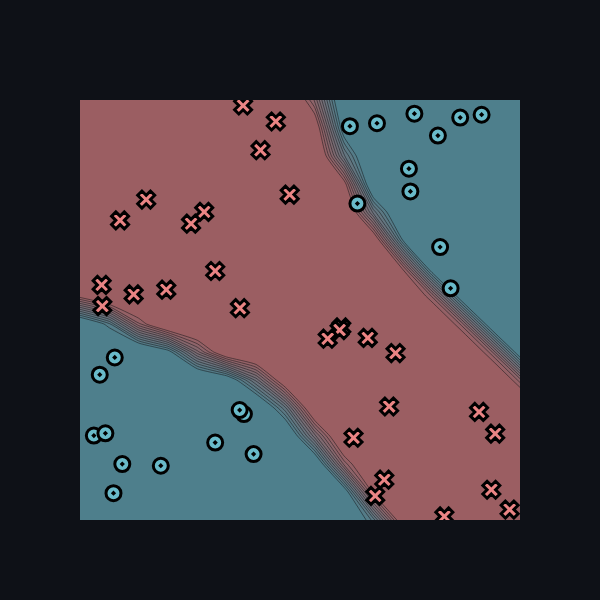 | 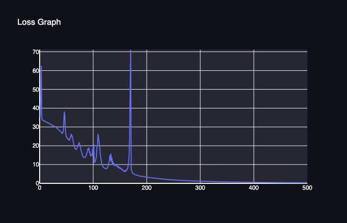 |

<details>
<summary>Training log</summary>

```text
Epoch: 10/500, loss: 33.1312667220423, correct: 33
Epoch: 20/500, loss: 31.79141928429271, correct: 33
Epoch: 30/500, loss: 30.108001824574654, correct: 35
Epoch: 40/500, loss: 27.53909952728893, correct: 35
Epoch: 50/500, loss: 26.124886735615046, correct: 39
Epoch: 60/500, loss: 26.340417278832113, correct: 35
Epoch: 70/500, loss: 18.516613151072942, correct: 41
Epoch: 80/500, loss: 15.394630838542762, correct: 45
Epoch: 90/500, loss: 16.616049411341695, correct: 41
Epoch: 100/500, loss: 18.48095345247832, correct: 43
Epoch: 110/500, loss: 26.293136161212047, correct: 37
Epoch: 120/500, loss: 8.572991792736133, correct: 47
Epoch: 130/500, loss: 10.94250304253538, correct: 45
Epoch: 140/500, loss: 10.77637262737791, correct: 46
Epoch: 150/500, loss: 8.475952898398324, correct: 45
Epoch: 160/500, loss: 6.728889914480177, correct: 48
Epoch: 170/500, loss: 48.60380298842455, correct: 34
Epoch: 180/500, loss: 4.524064104527041, correct: 50
Epoch: 190/500, loss: 3.7680445703990637, correct: 50
Epoch: 200/500, loss: 3.3142735095335922, correct: 50
Epoch: 210/500, loss: 2.927993397873596, correct: 50
Epoch: 220/500, loss: 2.59484675347129, correct: 50
Epoch: 230/500, loss: 2.317022262971187, correct: 50
Epoch: 240/500, loss: 2.0619600198807113, correct: 50
Epoch: 250/500, loss: 1.8327096217904881, correct: 50
Epoch: 260/500, loss: 1.6494141218651373, correct: 50
Epoch: 270/500, loss: 1.4881821753028848, correct: 50
Epoch: 280/500, loss: 1.3540077944698226, correct: 50
Epoch: 290/500, loss: 1.2274089801572516, correct: 50
Epoch: 300/500, loss: 1.1138402081346226, correct: 50
Epoch: 310/500, loss: 1.019261771599513, correct: 50
Epoch: 320/500, loss: 0.9386315989844017, correct: 50
Epoch: 330/500, loss: 0.8664614336390295, correct: 50
Epoch: 340/500, loss: 0.7939545818719407, correct: 50
Epoch: 350/500, loss: 0.7263175203813598, correct: 50
Epoch: 360/500, loss: 0.6676273408323095, correct: 50
Epoch: 370/500, loss: 0.6229362365200702, correct: 50
Epoch: 380/500, loss: 0.5844567434956441, correct: 50
Epoch: 390/500, loss: 0.5493126373812648, correct: 50
Epoch: 400/500, loss: 0.5188464850972738, correct: 50
Epoch: 410/500, loss: 0.4907360162347774, correct: 50
Epoch: 420/500, loss: 0.46440709935271707, correct: 50
Epoch: 430/500, loss: 0.43999302644965815, correct: 50
Epoch: 440/500, loss: 0.4184492490809098, correct: 50
Epoch: 450/500, loss: 0.39845689364993353, correct: 50
Epoch: 460/500, loss: 0.3802938710514825, correct: 50
Epoch: 470/500, loss: 0.36284555477553176, correct: 50
Epoch: 480/500, loss: 0.34690057590866963, correct: 50
Epoch: 490/500, loss: 0.33285148230146727, correct: 50
Epoch: 500/500, loss: 0.31866545995595896, correct: 50
```

</details>

## Task 3.1: Parallelization

<details>
<summary>Parallel diagnostics</summary>

```text
MAP

================================================================================
 Parallel Accelerator Optimizing:  Function tensor_map.<locals>._map,
minitorch/fast_ops.py
(162)
================================================================================


Parallel loop listing for  Function tensor_map.<locals>._map, minitorch/fast_ops.py (162)
----------------------------------------------------------------------------------------------------------|loop #ID
    def _map(                                                                                             |
        out: Storage,                                                                                     |
        out_shape: Shape,                                                                                 |
        out_strides: Strides,                                                                             |
        in_storage: Storage,                                                                              |
        in_shape: Shape,                                                                                  |
        in_strides: Strides,                                                                              |
    ) -> None:                                                                                            |
        same_shape = np.array_equal(out_shape, in_shape)                                                  |
        same_strides = np.array_equal(out_strides, in_strides)                                            |
                                                                                                          |
        # если совпадает и shape, и strides                                                               |
        # значит элементы входа и результата расположены одинаково                                        |
        if same_shape and same_strides:                                                                   |
            for ordinal in prange(len(out)):--------------------------------------------------------------| #0
                in_value = in_storage[ordinal]                                                            |
                out[ordinal] = fn(in_value)                                                               |
        # если формы или strides отличаются                                                               |
                                                                                                          |
        # f.e.                                                                                            |
        # input                                                                                           |
        #         [[10, 20, 30]]                                                                          |
        #output                                                                                           |
                # [                                                                                       |
                #     [20, 40, 60],                                                                       |
                #     [20, 40, 60],                                                                       |
                # ]                                                                                       |
        else:                                                                                             |
            for i in prange(len(out)):--------------------------------------------------------------------| #1
                out_index = np.empty(len(out_shape), dtype=np.int32)                                      |
                in_index = np.empty(len(in_shape), dtype=np.int32)                                        |
                                                                                                          |
                # без этого возникает ошибка Overwrite of parallel loop index                             |
                # и прикол в том, что Numba запрещает изменять переменную цикла prange,                   |
                # а  с помощью i + 0 создаём отдельное значение                                           |
                                                                                                          |
                # и вот + 0 надо делать,                                                                  |
                # так как j = i Numba считает просто вторым именем той же защищённой переменной цикла;    |
                # j = i + 0 создаёт новое вычисленное значение,                                           |
                # которое уже можно изменять внутри to_index                                              |
                                                                                                          |
                j = i + 0                                                                                 |
                                                                                                          |
                to_index(j, out_shape, out_index)                                                         |
                broadcast_index(out_index, out_shape, in_shape, in_index)                                 |
                out_position = index_to_position(out_index, out_strides)                                  |
                in_position = index_to_position(in_index, in_strides)                                     |
                                                                                                          |
                in_value = in_storage[in_position]                                                        |
                out[out_position] = fn(in_value)                                                          |
--------------------------------- Fusing loops ---------------------------------
Attempting fusion of parallel loops (combines loops with similar properties)...
Following the attempted fusion of parallel for-loops there are 2 parallel for-
loop(s) (originating from loops labelled: #0, #1).
--------------------------------------------------------------------------------
----------------------------- Before Optimisation ------------------------------
--------------------------------------------------------------------------------
------------------------------ After Optimisation ------------------------------
Parallel structure is already optimal.
--------------------------------------------------------------------------------
--------------------------------------------------------------------------------

---------------------------Loop invariant code motion---------------------------
Allocation hoisting:
The memory allocation derived from the instruction at
minitorch/fast_ops.py
(191) is hoisted out of the parallel loop labelled #1 (it will be performed
before the loop is executed and reused inside the loop):
   Allocation:: out_index = np.empty(len(out_shape), dtype=np.int32)
    - numpy.empty() is used for the allocation.
The memory allocation derived from the instruction at
minitorch/fast_ops.py
(192) is hoisted out of the parallel loop labelled #1 (it will be performed
before the loop is executed and reused inside the loop):
   Allocation:: in_index = np.empty(len(in_shape), dtype=np.int32)
    - numpy.empty() is used for the allocation.
None
ZIP

================================================================================
 Parallel Accelerator Optimizing:  Function tensor_zip.<locals>._zip,
minitorch/fast_ops.py
(238)
================================================================================


Parallel loop listing for  Function tensor_zip.<locals>._zip, minitorch/fast_ops.py (238)
--------------------------------------------------------------------------------------------|loop #ID
    def _zip(                                                                               |
        out: Storage,                                                                       |
        out_shape: Shape,                                                                   |
        out_strides: Strides,                                                               |
        a_storage: Storage,                                                                 |
        a_shape: Shape,                                                                     |
        a_strides: Strides,                                                                 |
        b_storage: Storage,                                                                 |
        b_shape: Shape,                                                                     |
        b_strides: Strides,                                                                 |
    ) -> None:                                                                              |
        # a:                                                                                |
        # [                                                                                 |
        #     [1, 2, 3],                                                                    |
        #     [4, 5, 6],                                                                    |
        # ]                                                                                 |
        #                                                                                   |
        # b:                                                                                |
        # [[10, 20, 30]]                                                                    |
        #                                                                                   |
        # out:                                                                              |
        # [                                                                                 |
        #     [11, 22, 33],                                                                 |
        #     [14, 25, 36],                                                                 |
        # ]                                                                                 |
                                                                                            |
        # одинаково ли расположены out и a                                                  |
        same_a_shape = np.array_equal(out_shape, a_shape)                                   |
        same_a_strides = np.array_equal(out_strides, a_strides)                             |
                                                                                            |
        # одинаково ли расположены out и b                                                  |
        same_b_shape = np.array_equal(out_shape, b_shape)                                   |
        same_b_strides = np.array_equal(out_strides, b_strides)                             |
                                                                                            |
        # все одинаково ли расположены                                                      |
        all_same = (same_a_shape and same_a_strides and same_b_shape and same_b_strides)    |
                                                                                            |
        if all_same:                                                                        |
            for i in prange(len(out)):------------------------------------------------------| #2
                a_value = a_storage[i]                                                      |
                b_value = b_storage[i]                                                      |
                                                                                            |
                out[i] = fn(a_value, b_value)                                               |
                                                                                            |
        else:                                                                               |
            for i in prange(len(out)):------------------------------------------------------| #3
                out_index = np.empty(len(out_shape), dtype=np.int32)                        |
                a_index = np.empty(len(a_shape), dtype=np.int32)                            |
                b_index = np.empty(len(b_shape), dtype=np.int32)                            |
                                                                                            |
                j = i + 0                                                                   |
                                                                                            |
                to_index(j, out_shape, out_index)                                           |
                broadcast_index(out_index, out_shape, a_shape, a_index)                     |
                broadcast_index(out_index, out_shape, b_shape, b_index)                     |
                                                                                            |
                out_position = index_to_position(out_index, out_strides)                    |
                a_position = index_to_position(a_index, a_strides)                          |
                b_position = index_to_position(b_index, b_strides)                          |
                                                                                            |
                a_value = a_storage[a_position]                                             |
                b_value = b_storage[b_position]                                             |
                                                                                            |
                out[out_position] = fn(a_value, b_value)                                    |
--------------------------------- Fusing loops ---------------------------------
Attempting fusion of parallel loops (combines loops with similar properties)...
Following the attempted fusion of parallel for-loops there are 2 parallel for-
loop(s) (originating from loops labelled: #2, #3).
--------------------------------------------------------------------------------
----------------------------- Before Optimisation ------------------------------
--------------------------------------------------------------------------------
------------------------------ After Optimisation ------------------------------
Parallel structure is already optimal.
--------------------------------------------------------------------------------
--------------------------------------------------------------------------------

---------------------------Loop invariant code motion---------------------------
Allocation hoisting:
The memory allocation derived from the instruction at
minitorch/fast_ops.py
(284) is hoisted out of the parallel loop labelled #3 (it will be performed
before the loop is executed and reused inside the loop):
   Allocation:: out_index = np.empty(len(out_shape), dtype=np.int32)
    - numpy.empty() is used for the allocation.
The memory allocation derived from the instruction at
minitorch/fast_ops.py
(285) is hoisted out of the parallel loop labelled #3 (it will be performed
before the loop is executed and reused inside the loop):
   Allocation:: a_index = np.empty(len(a_shape), dtype=np.int32)
    - numpy.empty() is used for the allocation.
The memory allocation derived from the instruction at
minitorch/fast_ops.py
(286) is hoisted out of the parallel loop labelled #3 (it will be performed
before the loop is executed and reused inside the loop):
   Allocation:: b_index = np.empty(len(b_shape), dtype=np.int32)
    - numpy.empty() is used for the allocation.
None
REDUCE

================================================================================
 Parallel Accelerator Optimizing:  Function tensor_reduce.<locals>._reduce,
minitorch/fast_ops.py
(325)
================================================================================


Parallel loop listing for  Function tensor_reduce.<locals>._reduce, minitorch/fast_ops.py (325)
------------------------------------------------------------------------|loop #ID
    def _reduce(                                                        |
        out: Storage,                                                   |
        out_shape: Shape,                                               |
        out_strides: Strides,                                           |
        a_storage: Storage,                                             |
        a_shape: Shape,                                                 |
        a_strides: Strides,                                             |
        reduce_dim: int,                                                |
    ) -> None:                                                          |
        #                                                               |
        # a:                                                            |
        # [                                                             |
        #     [1, 2, 3],                                                |
        #     [4, 5, 6],                                                |
        # ]                                                             |
        #                                                               |
        # reduce_dim = 1                                                |
        #                                                               |
        # out:                                                          |
        # [                                                             |
        #     [6],                                                      |
        #     [15],                                                     |
        # ]                                                             |
                                                                        |
        for i in prange(len(out)):--------------------------------------| #4
            out_index = np.empty(len(out_shape), dtype=np.int32)        |
            a_index = np.empty(len(a_shape), dtype=np.int32)            |
                                                                        |
            j = i + 0                                                   |
                                                                        |
            # индекс элемента результата                                |
            to_index(j, out_shape, out_index)                           |
                                                                        |
            # копируем индекс результата во входной индекс              |
            for dim in range(len(a_shape)):                             |
                a_index[dim] = out_index[dim]                           |
                                                                        |
            a_index[reduce_dim] = 0                                     |
                                                                        |
            out_position = index_to_position(out_index, out_strides)    |
                                                                        |
            # получаем начальную позицию во входном тензоре             |
            a_position = index_to_position(a_index, a_strides)          |
                                                                        |
            result = out[out_position]                                  |
                                                                        |
            # сколько элементов нужно объединить                        |
            reduce_size = a_shape[reduce_dim]                           |
                                                                        |
            # и на сколько позиций двигаться по storage                 |
            reduce_stride = a_strides[reduce_dim]                       |
                                                                        |
            for reduce_i in range(reduce_size):                         |
                a_value = a_storage[a_position]                         |
                result = fn(result, a_value)                            |
                a_position = a_position + reduce_stride                 |
                                                                        |
            out[out_position] = result                                  |
--------------------------------- Fusing loops ---------------------------------
Attempting fusion of parallel loops (combines loops with similar properties)...
Following the attempted fusion of parallel for-loops there are 1 parallel for-
loop(s) (originating from loops labelled: #4).
--------------------------------------------------------------------------------
----------------------------- Before Optimisation ------------------------------
--------------------------------------------------------------------------------
------------------------------ After Optimisation ------------------------------
Parallel structure is already optimal.
--------------------------------------------------------------------------------
--------------------------------------------------------------------------------

---------------------------Loop invariant code motion---------------------------
Allocation hoisting:
The memory allocation derived from the instruction at
minitorch/fast_ops.py
(350) is hoisted out of the parallel loop labelled #4 (it will be performed
before the loop is executed and reused inside the loop):
   Allocation:: out_index = np.empty(len(out_shape), dtype=np.int32)
    - numpy.empty() is used for the allocation.
The memory allocation derived from the instruction at
minitorch/fast_ops.py
(351) is hoisted out of the parallel loop labelled #4 (it will be performed
before the loop is executed and reused inside the loop):
   Allocation:: a_index = np.empty(len(a_shape), dtype=np.int32)
    - numpy.empty() is used for the allocation.
None
```

</details>

## Task 3.2: Matrix Multiplication


<details>
<summary>Parallel diagnostics</summary>

```text
MATRIX MULTIPLY

================================================================================
 Parallel Accelerator Optimizing:  Function _tensor_matrix_multiply,
minitorch/fast_ops.py
(387)
================================================================================


Parallel loop listing for  Function _tensor_matrix_multiply, minitorch/fast_ops.py (387)
--------------------------------------------------------------------------------------------------|loop #ID
def _tensor_matrix_multiply(                                                                      |
    out: Storage,                                                                                 |
    out_shape: Shape,                                                                             |
    out_strides: Strides,                                                                         |
    a_storage: Storage,                                                                           |
    a_shape: Shape,                                                                               |
    a_strides: Strides,                                                                           |
    b_storage: Storage,                                                                           |
    b_shape: Shape,                                                                               |
    b_strides: Strides,                                                                           |
) -> None:                                                                                        |
    """                                                                                           |
    NUMBA tensor matrix multiply function.                                                        |
                                                                                                  |
    Should work for any tensor shapes that broadcast as long as                                   |
                                                                                                  |
    ```                                                                                           |
    assert a_shape[-1] == b_shape[-2]                                                             |
    ```                                                                                           |
                                                                                                  |
    Optimizations:                                                                                |
                                                                                                  |
    * Outer loop in parallel                                                                      |
    * No index buffers or function calls                                                          |
    * Inner loop should have no global writes, 1 multiply.                                        |
                                                                                                  |
                                                                                                  |
    Args:                                                                                         |
        out (Storage): storage for `out` tensor                                                   |
        out_shape (Shape): shape for `out` tensor                                                 |
        out_strides (Strides): strides for `out` tensor                                           |
        a_storage (Storage): storage for `a` tensor                                               |
        a_shape (Shape): shape for `a` tensor                                                     |
        a_strides (Strides): strides for `a` tensor                                               |
        b_storage (Storage): storage for `b` tensor                                               |
        b_shape (Shape): shape for `b` tensor                                                     |
        b_strides (Strides): strides for `b` tensor                                               |
                                                                                                  |
    Returns:                                                                                      |
        None : Fills in `out`                                                                     |
    """                                                                                           |
    a_batch_stride = a_strides[0] if a_shape[0] > 1 else 0                                        |
    b_batch_stride = b_strides[0] if b_shape[0] > 1 else 0                                        |
                                                                                                  |
    out_rows = out_shape[1]                                                                       |
    out_columns = out_shape[2]                                                                    |
                                                                                                  |
    # колво умножений для одного элемента out                                                     |
    inner_size = a_shape[2]                                                                       |
                                                                                                  |
    for i in prange(len(out)):--------------------------------------------------------------------| #5
        batch = i // (out_rows * out_columns)                                                     |
        row = (i // out_columns) % out_rows                                                       |
        column = i % out_columns                                                                  |
                                                                                                  |
        out_position = batch * out_strides[0] + row * out_strides[1] + column * out_strides[2]    |
        a_position = batch * a_batch_stride + row * a_strides[1]                                  |
        b_position = batch * b_batch_stride + column * b_strides[2]                               |
                                                                                                  |
        result = 0.0                                                                              |
                                                                                                  |
        for _ in range(inner_size):                                                               |
            result = result + a_storage[a_position] * b_storage[b_position]                       |
            a_position = a_position + a_strides[2]                                                |
            b_position = b_position + b_strides[1]                                                |
                                                                                                  |
        out[out_position] = result                                                                |
--------------------------------- Fusing loops ---------------------------------
Attempting fusion of parallel loops (combines loops with similar properties)...
Following the attempted fusion of parallel for-loops there are 1 parallel for-
loop(s) (originating from loops labelled: #5).
--------------------------------------------------------------------------------
----------------------------- Before Optimisation ------------------------------
--------------------------------------------------------------------------------
------------------------------ After Optimisation ------------------------------
Parallel structure is already optimal.
--------------------------------------------------------------------------------
--------------------------------------------------------------------------------

---------------------------Loop invariant code motion---------------------------
Allocation hoisting:
No allocation hoisting found
None
```

</details>

## Tasks 3.3–3.4: CUDA Tests

CUDA tests were run in Google Colab on an NVIDIA Tesla T4 GPU.

```bash
pytest tests/ -m "task3_3 or task3_4" -q
```

```text
64 passed, 230 deselected, 133 warnings in 236.67s (0:03:56)
```

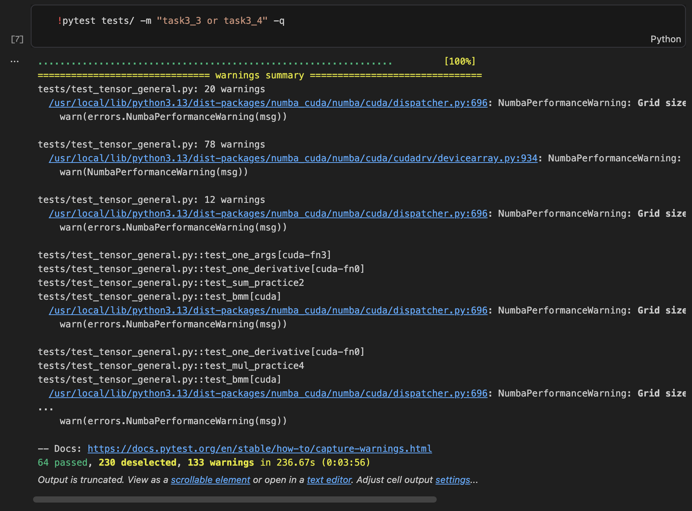

## Task 3.5: Training

| Dataset | Backend | Hidden | Time per epoch | Loss at epoch 490 | Correct |
|---|---|---:|---:|---:|---:|
| Simple | GPU | 100 | 1.545 s | 0.4853949255389723 | 50/50 |
| Split | GPU | 100 | 1.538 s | 0.28677027887611306 | 50/50 |
| Xor | GPU | 100 | 1.553 s | 0.9974842226741581 | 48/50 |
| Split | CPU | 100 | 0.146 s | 0.8351686878681607 | 50/50 |

### Simple GPU

<details>
<summary>Training log</summary>

```text
Epoch  0  loss  12.128307599809276 correct 21
Epoch  10  loss  2.3204456091690067 correct 48
Epoch  20  loss  1.34153453421105 correct 50
Epoch  30  loss  0.7090682790023817 correct 50
Epoch  40  loss  0.18551007666923913 correct 49
Epoch  50  loss  0.6328663734360522 correct 49
Epoch  60  loss  1.139061202472125 correct 50
Epoch  70  loss  0.8629160013569879 correct 50
Epoch  80  loss  0.6635260852524922 correct 49
Epoch  90  loss  0.255901787709804 correct 50
Epoch  100  loss  0.1808746528883815 correct 50
Epoch  110  loss  0.36288538333215 correct 49
Epoch  120  loss  0.33820478261906894 correct 50
Epoch  130  loss  0.4077492444553395 correct 50
Epoch  140  loss  0.35623396458219636 correct 49
Epoch  150  loss  0.11694656864919833 correct 50
Epoch  160  loss  0.9360084104140101 correct 50
Epoch  170  loss  0.034458875577533084 correct 50
Epoch  180  loss  0.38666048313807244 correct 50
Epoch  190  loss  0.4628952332029844 correct 50
Epoch  200  loss  0.012202865422603222 correct 49
Epoch  210  loss  1.1188728718501388 correct 50
Epoch  220  loss  0.0213167163938074 correct 50
Epoch  230  loss  0.9106860476016552 correct 50
Epoch  240  loss  0.6946257979047279 correct 50
Epoch  250  loss  0.0020589837299314763 correct 50
Epoch  260  loss  0.33503671131456814 correct 50
Epoch  270  loss  0.2958132463570041 correct 50
Epoch  280  loss  0.22373269096064247 correct 50
Epoch  290  loss  0.0019505638955891855 correct 50
Epoch  300  loss  0.36080404575728964 correct 50
Epoch  310  loss  0.5932483421762382 correct 50
Epoch  320  loss  0.048482517300749046 correct 50
Epoch  330  loss  0.0006255397271258222 correct 50
Epoch  340  loss  0.002879890564978961 correct 50
Epoch  350  loss  0.04113062304765408 correct 50
Epoch  360  loss  0.795866729693323 correct 50
Epoch  370  loss  0.7065242295810147 correct 50
Epoch  380  loss  0.6540136785575907 correct 50
Epoch  390  loss  0.13687458624089843 correct 50
Epoch  400  loss  0.3279914798571398 correct 50
Epoch  410  loss  0.05400219574191414 correct 50
Epoch  420  loss  0.6953293295457946 correct 50
Epoch  430  loss  0.0003428113298303071 correct 50
Epoch  440  loss  0.33086223008527965 correct 50
Epoch  450  loss  0.807210215551569 correct 49
Epoch  460  loss  0.00015514346614450646 correct 50
Epoch  470  loss  0.6226065849995293 correct 50
Epoch  480  loss  0.19427540432733012 correct 50
Epoch  490  loss  0.4853949255389723 correct 50
```

</details>

### Split GPU

<details>
<summary>Training log</summary>

```text
Epoch  0  loss  3.7741864563897236 correct 36
Epoch  10  loss  4.243151686494709 correct 38
Epoch  20  loss  2.9687333345871263 correct 42
Epoch  30  loss  2.6053060505563788 correct 43
Epoch  40  loss  3.581883160493348 correct 45
Epoch  50  loss  3.6919691277241222 correct 50
Epoch  60  loss  4.172637146610098 correct 45
Epoch  70  loss  2.276904134056588 correct 45
Epoch  80  loss  1.5551153315413953 correct 49
Epoch  90  loss  1.4835539428008566 correct 50
Epoch  100  loss  1.0976455850944373 correct 50
Epoch  110  loss  1.5668174254618985 correct 50
Epoch  120  loss  0.4458793369253661 correct 50
Epoch  130  loss  1.3339587153676615 correct 50
Epoch  140  loss  0.6611465194214127 correct 50
Epoch  150  loss  0.7548653656703648 correct 50
Epoch  160  loss  0.4143698347569569 correct 50
Epoch  170  loss  0.2301242518061863 correct 50
Epoch  180  loss  1.3254175388708962 correct 50
Epoch  190  loss  1.3496963991939097 correct 50
Epoch  200  loss  0.3457675988566696 correct 50
Epoch  210  loss  0.8902543794154385 correct 50
Epoch  220  loss  0.6669207881437349 correct 50
Epoch  230  loss  0.5246087459378677 correct 50
Epoch  240  loss  0.037555630102303346 correct 50
Epoch  250  loss  0.5011821693496333 correct 50
Epoch  260  loss  0.8390618182314285 correct 50
Epoch  270  loss  0.4820742023778965 correct 50
Epoch  280  loss  0.1647720297191309 correct 50
Epoch  290  loss  0.5824126074524983 correct 50
Epoch  300  loss  0.04687570958344887 correct 50
Epoch  310  loss  0.744311695896374 correct 50
Epoch  320  loss  0.4991741874653453 correct 50
Epoch  330  loss  0.0790325716874974 correct 50
Epoch  340  loss  0.2658847112962953 correct 50
Epoch  350  loss  0.40140472375139924 correct 50
Epoch  360  loss  0.19507237555366144 correct 50
Epoch  370  loss  0.13366316247975507 correct 50
Epoch  380  loss  0.07711482891202288 correct 50
Epoch  390  loss  0.057685207711993584 correct 50
Epoch  400  loss  0.4335180119819824 correct 50
Epoch  410  loss  0.06501549095023589 correct 50
Epoch  420  loss  0.1771177495934876 correct 50
Epoch  430  loss  0.015060279396969972 correct 50
Epoch  440  loss  0.28528056329276225 correct 50
Epoch  450  loss  0.3931691222291204 correct 50
Epoch  460  loss  0.05872104600928971 correct 50
Epoch  470  loss  0.027444932250810253 correct 50
Epoch  480  loss  0.03033778702741738 correct 50
Epoch  490  loss  0.28677027887611306 correct 50
```

</details>

### Xor GPU

<details>
<summary>Training log</summary>

```text
Epoch  0  loss  6.388318177962469 correct 30
Epoch  10  loss  5.689987997033487 correct 40
Epoch  20  loss  3.960694751941225 correct 40
Epoch  30  loss  2.941263145617536 correct 45
Epoch  40  loss  4.980569419472609 correct 42
Epoch  50  loss  4.495714236516611 correct 45
Epoch  60  loss  3.0142008237297957 correct 44
Epoch  70  loss  1.094895043528123 correct 45
Epoch  80  loss  2.8400988724769185 correct 44
Epoch  90  loss  1.9898230193875963 correct 47
Epoch  100  loss  3.6320834586006976 correct 44
Epoch  110  loss  4.009577548106584 correct 47
Epoch  120  loss  2.397752573818165 correct 47
Epoch  130  loss  1.8993423163584482 correct 46
Epoch  140  loss  1.0776354169977578 correct 47
Epoch  150  loss  3.4724886911524124 correct 43
Epoch  160  loss  0.3564586547587047 correct 49
Epoch  170  loss  0.9419504178625098 correct 48
Epoch  180  loss  1.3269863204503216 correct 48
Epoch  190  loss  2.503315358199693 correct 45
Epoch  200  loss  2.950847068683431 correct 47
Epoch  210  loss  2.0113304934156693 correct 49
Epoch  220  loss  2.3995872488681242 correct 48
Epoch  230  loss  1.3730598016448483 correct 47
Epoch  240  loss  0.26883990200685437 correct 48
Epoch  250  loss  1.172851209677513 correct 48
Epoch  260  loss  0.32041524291954304 correct 49
Epoch  270  loss  0.0495269559593845 correct 48
Epoch  280  loss  2.075284944182876 correct 48
Epoch  290  loss  1.4629456402555636 correct 50
Epoch  300  loss  0.04194684727714625 correct 48
Epoch  310  loss  2.2460302081238237 correct 49
Epoch  320  loss  0.49171669506066185 correct 47
Epoch  330  loss  1.013751798657418 correct 47
Epoch  340  loss  1.0486232430661835 correct 48
Epoch  350  loss  0.5347843477620837 correct 48
Epoch  360  loss  0.8788928301377867 correct 48
Epoch  370  loss  2.1001684715069664 correct 49
Epoch  380  loss  2.090618770213175 correct 47
Epoch  390  loss  0.058638196614093176 correct 48
Epoch  400  loss  1.983492540116236 correct 47
Epoch  410  loss  0.977934176883489 correct 47
Epoch  420  loss  0.7826925460731158 correct 49
Epoch  430  loss  1.3150181067587288 correct 49
Epoch  440  loss  0.41527322175448084 correct 49
Epoch  450  loss  2.3334480418307066 correct 48
Epoch  460  loss  1.20156654427465 correct 49
Epoch  470  loss  0.22969152320900288 correct 47
Epoch  480  loss  0.49132949878820675 correct 47
Epoch  490  loss  0.9974842226741581 correct 48
```

</details>

### Split CPU

<details>
<summary>Training log</summary>

```text
Epoch  0  loss  8.549627214725962 correct 25
Epoch  10  loss  5.72264550820708 correct 39
Epoch  20  loss  6.119853509624782 correct 40
Epoch  30  loss  6.212133182177263 correct 44
Epoch  40  loss  2.2684569694049537 correct 46
Epoch  50  loss  3.3954417114064834 correct 41
Epoch  60  loss  3.710479794497743 correct 48
Epoch  70  loss  2.346561409840917 correct 49
Epoch  80  loss  1.64318860716652 correct 49
Epoch  90  loss  1.656722382698493 correct 49
Epoch  100  loss  1.023142688093731 correct 49
Epoch  110  loss  1.7606158907452234 correct 50
Epoch  120  loss  0.565429982832098 correct 49
Epoch  130  loss  1.3477792867487122 correct 49
Epoch  140  loss  2.2218014976771707 correct 50
Epoch  150  loss  1.8624397135921913 correct 49
Epoch  160  loss  1.279377171444367 correct 49
Epoch  170  loss  0.6722042759214795 correct 49
Epoch  180  loss  1.1926909646198864 correct 50
Epoch  190  loss  0.5737620202168182 correct 49
Epoch  200  loss  1.0387860469750614 correct 49
Epoch  210  loss  0.5644937659019637 correct 49
Epoch  220  loss  0.3274592813389887 correct 50
Epoch  230  loss  0.9691610503054934 correct 50
Epoch  240  loss  0.5339429735831398 correct 49
Epoch  250  loss  0.9626831085146684 correct 50
Epoch  260  loss  0.7531941636101318 correct 50
Epoch  270  loss  0.11458799625607985 correct 49
Epoch  280  loss  0.24002954153727432 correct 50
Epoch  290  loss  1.0725214671392966 correct 50
Epoch  300  loss  0.34484844498600414 correct 50
Epoch  310  loss  0.5767110351943158 correct 50
Epoch  320  loss  0.44616580364483677 correct 50
Epoch  330  loss  0.4927083127902468 correct 49
Epoch  340  loss  0.6220222809721405 correct 50
Epoch  350  loss  0.7793529736836687 correct 50
Epoch  360  loss  0.34950785290706854 correct 50
Epoch  370  loss  0.7105878424761822 correct 50
Epoch  380  loss  0.8652437391353454 correct 50
Epoch  390  loss  0.7990665124511689 correct 50
Epoch  400  loss  0.13254071406620146 correct 50
Epoch  410  loss  0.25518642963913696 correct 50
Epoch  420  loss  0.04196033259767589 correct 50
Epoch  430  loss  0.15874081100576898 correct 50
Epoch  440  loss  0.019919948708985998 correct 50
Epoch  450  loss  0.08550172559777387 correct 50
Epoch  460  loss  0.11556894114186156 correct 50
Epoch  470  loss  0.5970457524302031 correct 50
Epoch  480  loss  0.20336407641494145 correct 50
Epoch  490  loss  0.8351686878681607 correct 50
```

</details>
